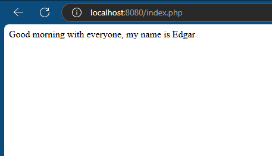
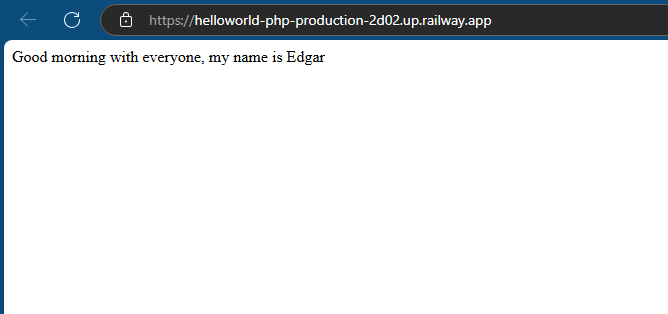

# PHP Web Application Example

This is a simple PHP web application that outputs a greeting message when accessed via a web browser.

## Description

This project is a simple PHP application that displays the message: **"Good morning with everyone, my name is Edgar"**. The application demonstrates how to set up a basic PHP script in a web server environment.

## Features

- PHP script that displays a personalized greeting.
- No database or additional frameworks are required.
- Simple setup for local testing.

## Prerequisites

To run this application locally, you will need the following:

- PHP 7.4 or higher installed on your system.
- A local server environment like [XAMPP](https://www.apachefriends.org/index.html), [MAMP](https://www.mamp.info/en/), or [WampServer](https://www.wampserver.com/en/).
- A web browser to access the application.

## Installation

### Clone the repository

```bash
git clone https://github.com/epgarzonr10/HelloWorld-php.git
cd PHPWebApp
```
### Running the Application

1. Move the `index.php` file to the appropriate folder in your local server (e.g., `htdocs` for XAMPP).

2. Open your local server software (XAMPP, MAMP, etc.) and start Apache (and MySQL if needed).

3. Open your web browser and navigate to:
```bash
http://localhost:8080/index.php

```
<p align="center">
  
</p>

## Railway Results
<p align="center">
  
</p>
